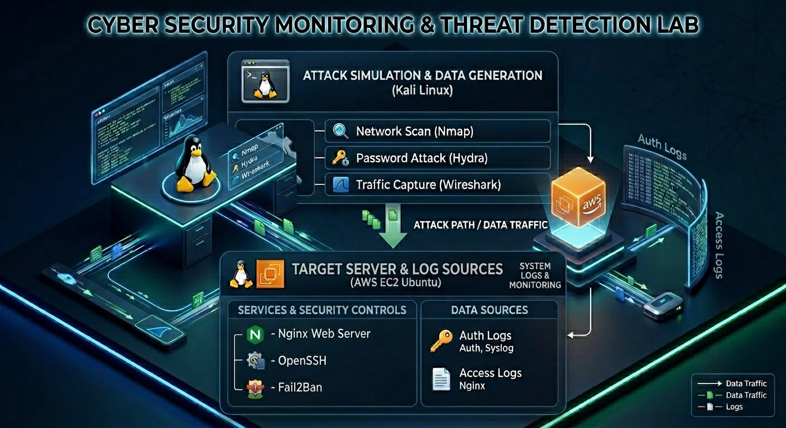
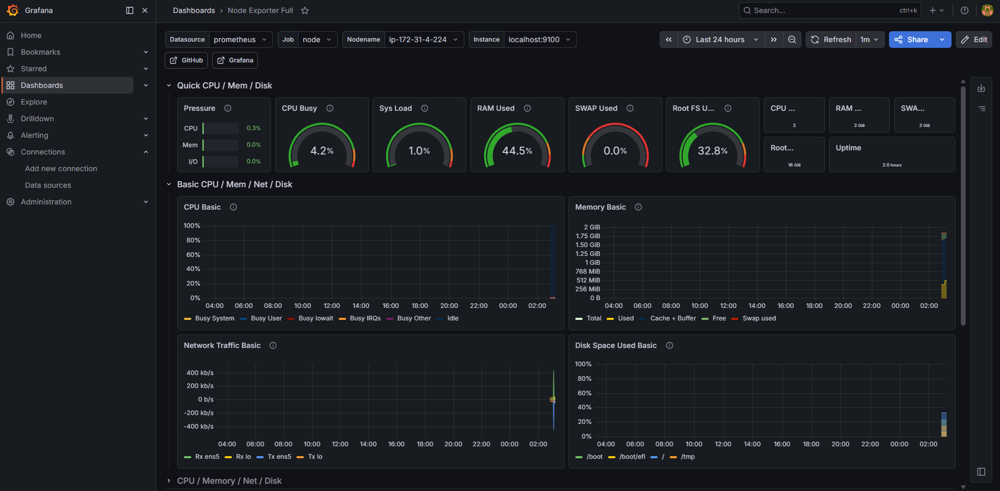

# Cloud Security Monitoring & Threat Detection Lab

A hands-on cloud security project demonstrating attack simulation, threat detection, log analysis, security monitoring, and automated incident response using AWS and open-source security tools.

## Project Status

### Version 1.0 (Completed)

Version 1 focused on cloud infrastructure deployment, attack simulation, security monitoring, and automated incident response.

**Implemented Components**

* AWS EC2 Ubuntu Server
* Nginx Web Server
* OpenSSH
* Nmap Reconnaissance
* Wireshark Traffic Analysis
* Hydra SSH Brute Force Simulation
* Authentication Log Analysis
* Fail2Ban Automated Response
* Security Documentation & Reporting

### Version 2.0 (Completed)

Version 2 extended the lab into a SOC-style monitoring environment using Grafana, Prometheus, and Node Exporter.

**Implemented Components**

* Dedicated Monitoring Server
* Grafana Dashboard
* Prometheus Monitoring
* Node Exporter Metrics Collection
* Real-Time Infrastructure Monitoring
* Security Monitoring Dashboard
* Dashboard-Based Reporting & Visualization

---

## Architecture Diagram



## Security Monitoring Dashboard

The monitoring platform was built using Grafana, Prometheus, and Node Exporter to provide real-time visibility into infrastructure health and performance metrics.



---

## Technologies Used

### Cloud & Infrastructure

* AWS EC2
* Ubuntu Server
* Kali Linux

### Security Tools

* Nmap
* Wireshark
* Hydra
* OpenSSH
* Fail2Ban
* Nginx

### Monitoring & Visualization

* Grafana
* Prometheus
* Node Exporter

---

## Skills Demonstrated

* AWS EC2 Administration
* Linux System Administration
* Network Security
* Threat Detection
* Security Monitoring
* Vulnerability Assessment
* Incident Response
* Cloud Security
* Authentication Log Analysis
* Security Operations Fundamentals
* Dashboard Deployment & Monitoring
* Infrastructure Monitoring

---

## Architecture

```text
Kali Linux (Attack Workstation)
        │
        ▼
AWS Ubuntu Target Server
(Nginx + OpenSSH + Fail2Ban)
        │
        ▼
Authentication & System Logs
        │
        ▼
Monitoring Server
(Prometheus + Node Exporter)
        │
        ▼
Grafana Dashboard
        │
        ▼
Security Monitoring & Visualization
```

---

## Project Progress

### Version 1.0

* [x] AWS Account Setup
* [x] Ubuntu EC2 Deployment
* [x] Nginx Installation
* [x] Nmap Reconnaissance
* [x] Service Enumeration
* [x] Wireshark Traffic Analysis
* [x] SSH Security Hardening Analysis
* [x] SSH Brute Force Simulation
* [x] Authentication Log Analysis
* [x] Fail2Ban Detection & Response

### Version 2.0 (Completed - Monitoring Dashboard)

* [x] Monitoring Server Deployment
* [x] Grafana Installation
* [x] Prometheus Installation
* [x] Node Exporter Installation
* [x] Prometheus Data Source Configuration
* [x] Grafana Dashboard Deployment
* [x] Infrastructure Monitoring Dashboard
* [x] Security Monitoring Visualization

---

## Completed Milestones

### Milestone 1: Cloud Infrastructure Setup

* Created AWS EC2 Ubuntu Server
* Configured Security Groups
* Deployed Nginx Web Server

### Milestone 2: Reconnaissance & Traffic Analysis

* Performed Nmap Port Scanning
* Enumerated Running Services
* Captured and Analyzed Network Traffic using Wireshark

### Milestone 3: SSH Attack Detection & Log Analysis

* Analyzed SSH Security Configuration
* Enabled Password Authentication for Lab Testing
* Created Dedicated Test User
* Simulated SSH Brute Force Attack using Hydra
* Monitored Authentication Logs
* Identified Failed Login Attempts
* Documented Detection Evidence

### Milestone 4: Automated Threat Detection & Response

* Installed Fail2Ban
* Configured SSH Protection Jail
* Generated SSH Brute Force Attempts
* Detected Authentication Failures
* Automatically Banned Attacking IP
* Collected Detection Evidence

### Milestone 5: Security Monitoring Dashboard

* Deployed Dedicated Monitoring Server
* Installed Grafana
* Installed Prometheus
* Installed Node Exporter
* Configured Prometheus Data Source
* Imported Monitoring Dashboard
* Visualized Real-Time Infrastructure Metrics
* Built Security Monitoring Dashboard

---

## Attack Scenarios

### Scenario 1: Nmap Reconnaissance & Traffic Analysis

* Port Scanning
* Service Enumeration
* Wireshark Packet Analysis

### Scenario 2: SSH Brute Force Detection

* SSH Security Configuration Review
* Hydra Brute Force Simulation
* Authentication Log Analysis
* Detection Evidence Collection

### Scenario 3: Fail2Ban Detection & Automated Response

* Fail2Ban Installation & Configuration
* SSH Protection Jail Setup
* Multiple Failed Login Attempt Simulation
* Authentication Failure Detection
* Automated IP Address Blocking
* Incident Response Validation

---

## Monitoring Dashboard

The Grafana dashboard provides:

* CPU Monitoring
* Memory Monitoring
* Disk Usage Monitoring
* Network Traffic Monitoring
* System Load Monitoring
* Infrastructure Health Visibility

Monitoring data is collected through Node Exporter and Prometheus before being visualized in Grafana.

---

## Repository Structure

```text
architecture/
attack-scenarios/
aws/
docs/
grafana/
screenshots/
README.md
```

---

## Future Enhancements

* Centralized Log Collection
* Security Alert Correlation
* Real-Time Security Alerting
* Security Event Analytics
* SIEM Integration
* Wazuh Deployment

---

## Goal

Build a cloud-based Security Operations Center (SOC) lab capable of detecting, monitoring, visualizing, and responding to security threats in real time.
